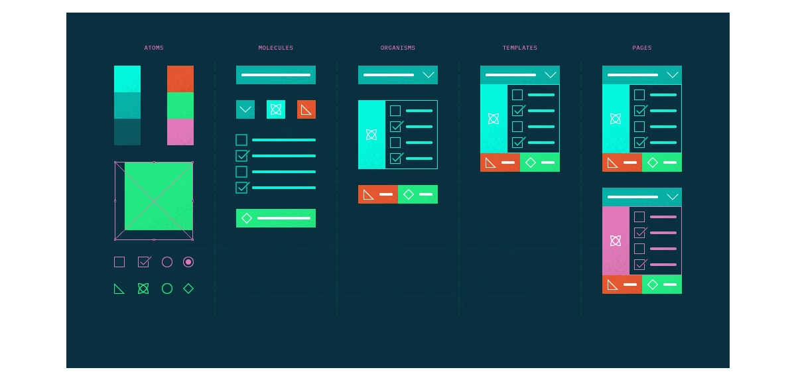

# Ozow UI


<small style="font-size: 10px">Art by <a href="https://dribbble.com/codycai">Codi Cai</a>
  </small>

[](https://www.npmjs.com/package/@storybook/design-system) [](https://standardjs.com)

##### Ozow UI is a design system that is meant to be a reusable set of components that can be quickly used to build and scaffold any application. Current it is used to demo a UI library for [Ozow](https://ozow.com).

Note: this design system is not used in Ozow's UI. This is purely for experimental reasons and is not the property of Ozow.

## Tech stack

Building components

- ⚛️ [React |](https://reactjs.org/) declarative component-centric UI
- 📚 [Storybook |](https://storybook.js.org) for UI component development and [auto-generated docs](https://medium.com/storybookjs/storybook-docs-sneak-peak-5be78445094a)
- <💅🏾> [Styled Components |](https://www.styled-components.com/) for component-scoped styling

Maintaining the system

- 📦 [NPM |](https://www.npmjs.com/) for [packaging and distribution](https://blog.hichroma.com/how-packaging-makes-it-dead-simple-to-share-ui-components-29912593539d)
- [Auto |](https://intuit.github.io/auto/)Streamline release workflows and automate publish constantly!
- ✅ [Chromatic |](https://www.chromatic.com/) to prevent UI bugs in components (by Storybook maintainers)
- 🚥 [GitHub Actions |](https://github.com/features/actions) Continuous integration

## Our Approach


<small style="font-size: 10px">Art by <a href="https://dribbble.com/codycai">Codi Cai</a>
</small>

We use Atomic Design by [Bred Frost](https://bradfrost.com/) to scope and organise our UI components.

## Why

The Storybook design system codifies existing UI components into a central, well-maintained repository. It is built to address having to paste the same components into multiple projects again and again. This simplifies building UI's with Storybook's design patterns.

#### What we're doing

- Build and maintain a design system in the open
- Share UI components between multiple apps
- Dogfood upcoming Storybook features
- Welcome contributors of all levels and backgrounds

#### What we're not doing

- Rewrite all new components from scratch
- Overhaul the visual design of components
- Typescript (the consumer apps don't use it)
- Compete with more general design systems like ANT or Material.

## Install

```bash
yarn add --save @sibabale/design-system
```

or

```bash
npm install --save @sibabale/design-system
```

## Run

```bash
yarn run storybook
```

or

```bash
npm run storybook
```

## Test

```bash
yarn test-storybook --watch
```

or

```bash
npm test-storybook --watch
```

## Build

- Storybook

```bash
yarn run build-storybook
```

or

```bash
npm run build-storybook
```

- Storybook Docs

```bash
yarn run build-storybook-docs
```

or

```bash
npm run build-storybook-docs
```

## Deploy

- Chromatic

```bash
npm run chromatic
```

NB: Create a .env file and add a `CHROMATIC_PROJECT_TOKEN`

## License

MIT © [Sibabale](https://github.com/sibabale)
